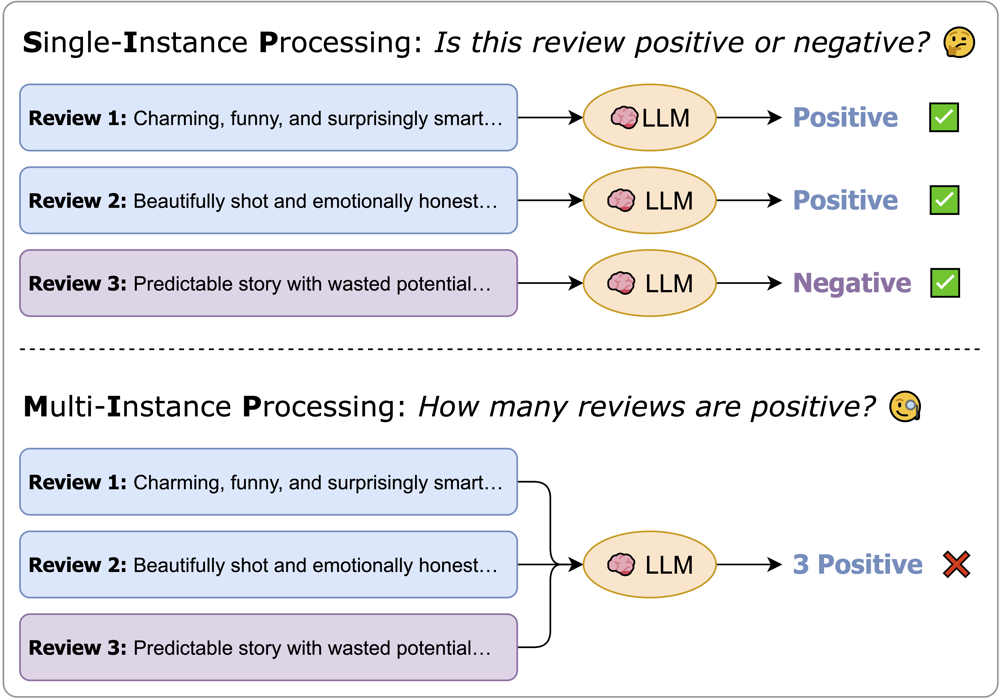
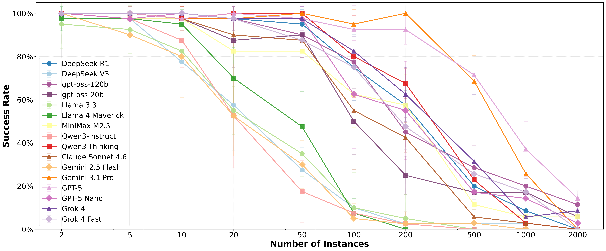

# Understanding LLM Performance Degradation in Multi-Instance Processing: The Roles of Instance Count and Context Length

<p align="center">
    <a href="https://arxiv.org/abs/2603.22608" target="_blank" rel="noopener noreferrer">
        
    </a>
</p>


We investigate how large language models handle multi-instance processing (MIP), where multiple inputs must be analysed and aggregated within a single prompt. Our results show that performance degrades as the number of instances increases, with instance count having a stronger impact than context length.

<p align="center">
  
  &nbsp;&nbsp;&nbsp;&nbsp;&nbsp;&nbsp;&nbsp;&nbsp;&nbsp;
  
</p>

<br>

<p align="center">
  
</p>


## Quick Start

### 1. Install and Setup

```bash
# Install dependencies
pip install -r requirements.txt

# Configure API key
cp .env.example .env
# Edit .env and add your API key / endpoint
# You can switch from OpenRouter to any OpenAI-compatible endpoint by changing BASE_URL in .env
```

### 2. Configure Experiment

Edit configuration files in `config/` folder:
- `models.yaml` - List of models to evaluate
- `selections/`, `shuffle/`, `artificial_length/`, `natural_length/` - Experiment configurations
- `questions/` - Question templates for each dataset

### 3. Run Evaluation

```bash
# Use default config/experiment.yaml without noise injection
python run_evaluation.py

# With specific config file
python run_evaluation.py --config config/natural_length/tweets.yaml

# With noise augmentation (inject irrelevant context at head/middle/tail/random position)
python run_evaluation.py --augment_approach tail
```

Results are saved in timestamped `outputs/` folders with:
- `summary.csv` - Complete results table
- `checkpoint.csv` - Resume checkpoint
- `ground_truth.csv` - Expected answers
- `raw/` - Raw API responses
- `evaluation.log` - Detailed logs

Notes:
- Token cost fields in `summary.csv` are only populated when `config/model_info.csv` exists.
- If `config/model_info.csv` is missing, evaluation still runs and cost fields remain empty.
- Three columns are required by `config/model_info.csv`: ``model_name``, ``prompt_price_per_1m``, ``completion_price_per_1m``.

## Configuration

Example configuration (`config/experiment.yaml`):

```yaml
dataset:
  type: tweets
  path: data/tweets

evaluation:
  models: null              # null = all models, or ['model1', 'model2']
  questions: null           # null = all questions, or ['Q1', 'Q2']
  n_trials: 1               # Number of trials per combination
  max_concurrent: 5         # Concurrent API requests (1-200)
  resume_from: null         # Timestamp to resume interrupted run

# Noise injection is set via CLI flag, not in config:
# python run_evaluation.py --augment_approach [default|head|middle|tail|random]

tweets:
  instance_selection: first_n    # 'first_n', 'sliding_window', or 'custom'
  counts: [1, 2, 5, 10, 20, 50, 100, 200, 500, 1000, 2000]  # Data sizes to test
```

### Resume Interrupted Runs

Set `resume_from: "YYYYMMDD_HHMMSS"` in your config to continue from a checkpoint.

